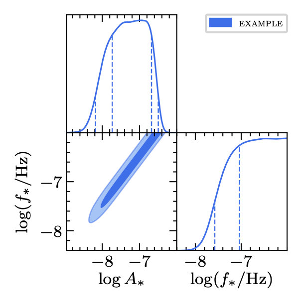

# Getting started  
PTArcade streamlines the implementation of Bayesian inference analyses for PTA data
by providing an easy-to-use wrapper of [ENTERPRISE] and [Ceffyl].

Already confused? Let's try to be more concrete. Say you have a new-physics model 
that produces a gravitational-wave background with a relic abundance given by
$\Omega_{\textrm{GW}}(f;\,\vec{\theta})$, where $\vec{\theta}$ is a set of parameters
describing the signal. You might now be interested in knowing if there are regions in 
the $\vec{\theta}$ parameter space that could reproduce the signal observed in PTA
data.[^1] PTArcade will allow you to answer this question in under 10 minutes
(plus computational time) using real PTA data and the same statistical tools
used by PTA collaborations.

[^1]: See [here][NG15] for more details about the PTA signal.

The only thing that is asked of the user is to define the GWB produced by their model 
and the prior distribution of the model parameters. This is done via, what we call, a
[_model file_][model]. Let's consider the specific example where

$$
h^2\Omega_{\textrm{GW}}(f) = \frac{A_*}{f/f_* + f_*/f}.
$$

In this case, the model file will look something like this

``` py 
from ptarcade.models_utils import prior

parameters = {# (1)! 
            'log_A_star' : prior("Uniform", -14, -6), # (4)! 
            'log_f_star' : prior("Uniform", -10, -6)
            }

def S(x):
    return 1 / (1/x + x)

def spectrum(f, log_A_star, log_f_star):  # (2)!
    A_star = 10**log_A_star
    f_star = 10**log_f_star
    
    return A_star * S(f/f_star) # (3)!
```

1. The parameter priors are defined via a dictionary named `parameters`. The
keys of this dictionary will be the names of the model parameters, and the
values are parameter objects specifying the parameter prior distributions.

2. The GWB spectrum is defined via the `spectrum` function. The first argument
of this function has to be called `f` and is supposed to be an array of frequencies
(in units of Hz) at which the spectrum will be evaluated. The remaining parameters
should be named like the keys of the `parameters` dictionary. 

3. For any given set of new-physics parameters, in this example `log_A_star` and 
`log_f_star`, the `spectrum` function should return an array which contains the value of
 $h^2\Omega_{\textrm{GW}}$ evaluated at those parameter values and at all the 
 frequencies contained in the `f` list.
 
4. Use any prior from [enterprise.signals.parameter][] or [ptarcade.models_utils][].

Once you have defined the model file, you can feed it to PTArcade by running it in a 
terminal 

```shell
ptarcade -m ./model_file.py # (1)!
```

1. The argument passed to the `-m` input flag should be the path to the model file. 
Here, we are assuming that the model file is named `model_file.py` and is located in
the folder from which we are running PTArcade. 

This will implement and run the analysis, whose results are [Markov chains][MC] that
can be used to derive [posterior distributions][posterior] for the parameters of
our model. For the example that we are considering, this yields the result:

{: align=left  style="height:380px;width:380px"}


  [Example posteriors]: ../assets/images/ex_post.png

<sub> The lower left panel shows the 68% and 95% levels of the 2D posterior
distribution for the $\log_{10}A_*$ and $\log_{10}(f/{\rm Hz})$ parameters. The 
other two panels report 1D marginalized posterior distributions. The dashed vertical
lines in the plots for the 1D distributions indicate the 68% credible intervals.</sub>


!!! info "Deterministic signals"
    PTArcade can also be used with deterministic signals. In this case, the user will
    have to specify the signal time series instead of the signal power-spectrum in the
    model file. See [here][model] for more details. 

The chains produced by PTArcade can also be used to derive [excluded regions][K_bound] of the 
parameter space and to perform [model selection][mod_sel] against the standard astrophysical interpretation
of the PTA signal in terms of supermassive black-hole binaries.

After this high-level summary of what PTArcade can do, in the next sections, we will
discuss:

- How to install PTArcade ([locally][local_install], or [on a cluster][hpc_install])
- [How to define a model file][model]
- How to change the parameters of PTArcade runs (PTA dataset, number of MC points, ...)
using a [configuration file][config]
- The structure of the [PTArcade outptut][output]
- PTArcade utilities that can [help in constructing model files][model_utils] or
 [analyzing][chain_utils] and [plotting][plot_utils] the MC chains.

!!! note "How to cite PTArcade"

    If you use PTArcade in your work, please cite

    ```
    @article{andrea mitridate_2023,
        title={PTArcade},
        DOI={10.5281/zenodo.7876430},
        publisher={Zenodo},
        author={Andrea Mitridate}, 
        year={2023}, 
        month={Apr},
        copyright = {Open Access}}

    @article{mitridate...}    
    ```

  [ENTERPRISE]: https://github.com/nanograv/enterprise
  [Ceffyl]: https://github.com/astrolamb/ceffyl
  [local_install]: local_install.md
  [hpc_install]: hpc_install.md
  [model]: ../inputs/model.md#stochastic-signals
  [config]: ../inputs/config.md
  [output]: ../outputs.md
  [model_utils]: ../utils/model_utils.md
  [chain_utils]: ../utils/chain_utils.md
  [plot_utils]: ../utils/plot_utils.md
  [NG15]: https://aas.com
  [MC]: https://en.wikipedia.org/wiki/Markov_chain#:~:text=A%20Markov%20chain%20or%20Markov,attained%20in%20the%20previous%20event.
  [posterior]: https://en.wikipedia.org/wiki/Posterior_probability#:~:text=In%20the%20context%20of%20Bayesian,a%20collection%20of%20observed%20data.
  [K_bound]: ../utils/plot_utils.md
  [mod_sel]: ../utils/chain_utils.md#+compute_bf
